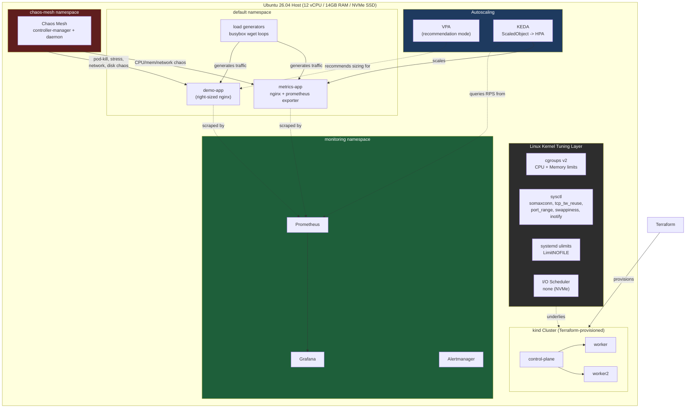

# Infrastructure Cost & Performance Optimization + Chaos Engineering

Production-grade DevOps project: taking a running application and making it
**cheaper to run** and **more resilient**, using both infrastructure-level
tuning (autoscaling, right-sizing) and deep Linux kernel-level tuning
(cgroups, sysctl, ulimits, syscall/CPU-level tracing) — then proving the
optimizations hold up under deliberately injected failure via chaos
engineering.

**Stack:** Terraform · Kubernetes (kind) · VPA · KEDA (custom-metric HPA) ·
Chaos Mesh · Prometheus/Grafana · Linux kernel tuning (cgroups v2, sysctl,
strace/perf/bpftrace)

---

## Architecture



---

## Repository Structure

```
.
├── terraform/                  # kind cluster provisioning
├── k8s-manifests/
│   ├── app/                    # demo-app, metrics-app, load generators
│   ├── hpa/                    # KEDA ScaledObjects (untuned + tuned)
│   └── vpa/                    # VerticalPodAutoscaler config
├── kernel-tuning/
│   ├── cgroups/                # manual cgroup v2 CPU + memory limiting
│   ├── sysctl/                 # network + memory + inotify tuning
│   └── io-scheduler/           # none vs mq-deadline benchmarks
├── profiling/
│   ├── strace/                 # I/O bottleneck diagnosis
│   ├── perf/                   # CPU hotspot diagnosis
│   └── bpftrace/               # live eBPF tracing
├── chaos-experiments/          # pod-kill, noisy-neighbor, network, disk chaos
├── monitoring/                 # Prometheus/Grafana/KEDA install notes
└── docs/
    ├── before-after/           # right-sizing + HPA comparison evidence
    └── cost-report/            # dollar-cost savings estimate
```

---

## Part 0 — Environment Setup

### Tooling already available
Docker 29.1.3, kubectl v1.37.0, kind v0.23.0, Helm v3.21.4, Terraform
v1.16.1, bpftrace v0.25.0, perf v7.0.14, strace v6.19, sysstat v12.7.7.

### Cluster provisioning (Terraform + kind)
```bash
cd terraform
terraform init
terraform plan
terraform apply -auto-approve
export KUBECONFIG="$(terraform output -raw kubeconfig_path)"
kubectl get nodes -o wide
```
**Result:** 1 control-plane + 2 workers, all `Ready`, Kubernetes v1.33.1.

> Provider fix note: `tehcnokrat/kind` in the Terraform registry does not
> exist — the correct source is `tehcyx/kind`.

### metrics-server (patched for kind's self-signed kubelet certs)
```bash
kubectl apply -f https://github.com/kubernetes-sigs/metrics-server/releases/latest/download/components.yaml
kubectl patch deployment metrics-server -n kube-system --type='json' \
  -p='[{"op":"add","path":"/spec/template/spec/containers/0/args/-","value":"--kubelet-insecure-tls"}]'
kubectl top nodes
```

### Prometheus + Grafana (kube-prometheus-stack)
```bash
helm repo add prometheus-community https://prometheus-community.github.io/helm-charts
helm repo add grafana https://grafana.github.io/helm-charts
helm repo update
kubectl create namespace monitoring
helm install kube-prom-stack prometheus-community/kube-prometheus-stack \
  --namespace monitoring \
  --set grafana.adminPassword=admin123 \
  --set prometheus.prometheusSpec.retention=6h
```
> Run **without** `--wait` — first-time image pulls for this stack can
> exceed Helm's default wait timeout even though the install succeeds.

---

## Part A — Resource Right-Sizing

**Goal:** deploy a deliberately over-provisioned app, measure real usage,
right-size it based on data.

### 1. Deploy over-provisioned demo-app (4 replicas)
```yaml
resources:
  requests: { cpu: "2000m", memory: "1Gi" }
  limits:   { cpu: "2500m", memory: "1.5Gi" }
```

### 2. Measure real usage under load
```bash
kubectl apply -f k8s-manifests/app/load-generator.yaml   # busybox wget loop
kubectl top pods -l app=demo-app
```
**Result (idle → under load):**
| Pod | CPU Used | Memory Used |
|-----|----------|-------------|
| all 4 pods | 1m → 3m | 9-10Mi |

Requested 2000m CPU / 1Gi memory → actual usage **~0.05-0.15% CPU, ~1%
memory**.

### 3. VPA recommendation (recommendation mode, `updateMode: "Off"`)
```bash
./hack/vpa-up.sh   # install VPA from kubernetes/autoscaler (full clone, not --depth 1 — tags are required)
kubectl apply -f k8s-manifests/vpa/demo-app-vpa.yaml
kubectl describe vpa demo-app-vpa
```
**VPA Target recommendation:** CPU **25m**, Memory **250Mi**.

### 4. Right-size based on recommendation + headroom
```yaml
resources:
  requests: { cpu: "50m", memory: "300Mi" }    # 2x / +20% headroom over VPA target
  limits:   { cpu: "200m", memory: "400Mi" }
```

### 5. Before / After — cluster-wide impact (4 replicas)
| Resource | Before | After | Freed |
|----------|--------|-------|-------|
| CPU | 8000m (8 cores) | 200m | **7800m (97.5%)** |
| Memory | 4096Mi (4Gi) | 1200Mi | **2896Mi (70.7%)** |

### 6. Cost estimate (AWS EC2 on-demand reference pricing)
| Resource | Freed | Monthly cost equivalent |
|----------|-------|---------------------------|
| CPU | 7.8 cores | ~$273/month |
| Memory | 2.83 GiB | ~$25/month |
| **Total** | | **~$298/month per 4-replica app** |

Full detail: `docs/cost-report/part-a-cost-savings.md`

---

## Part B — Autoscaling Tuning (HPA via KEDA)

**Goal:** scale on a custom metric (RPS, not just CPU), and eliminate
scale-up/scale-down flapping under bursty traffic.

### 1. metrics-app: nginx + nginx-prometheus-exporter sidecar
Exposes `nginx_http_requests_total`, scraped by Prometheus via a
`ServiceMonitor`.

### 2. KEDA install + ScaledObject (Prometheus-metric trigger)
```bash
helm install keda kedacore/keda --namespace keda
```
```yaml
triggers:
  - type: prometheus
    metadata:
      query: sum(rate(nginx_http_requests_total[30s]))
      threshold: "5"
```

### 3. Untuned behavior — 0s stabilization windows
```yaml
behavior:
  scaleUp:   { stabilizationWindowSeconds: 0 }
  scaleDown: { stabilizationWindowSeconds: 0 }
```
Bursty load generator: 30s burst / 20s quiet, repeating.

**Result — replica count over 5 minutes (flapping):**
```
2 → 4 → 6 → 2 → 4 → 6 → 4 → 2 → 4 → 5 → 2 → 4 → 6 → 2 → 4 → 6 → 3 → 2 → ...
```
Oscillated every 30-40s, tracking every burst/quiet cycle exactly.

### 4. Tuned behavior — 30s scale-up / 120s scale-down stabilization
```yaml
behavior:
  scaleUp:   { stabilizationWindowSeconds: 30 }
  scaleDown: { stabilizationWindowSeconds: 120 }
```
**Result — same load pattern:**
```
4 → 4 → 4 → 4 → 4 → 6 → 6 → 6 → 6 → 6 → 6 ... (stable)
```
One clean scale-up, then held steady — despite the underlying RPS metric
being equally noisy in both runs.

### 5. Grafana evidence
Query: `kube_deployment_status_replicas{deployment="metrics-app"}` —
screenshot in `docs/before-after/hpa-flapping-vs-tuned-grafana.png` shows
the sawtooth (untuned) followed by a flat stable line (tuned) in a single
graph.

Full comparison: `docs/before-after/part-b-comparison.md`

---

## Part C — Linux Kernel & OS-Level Tuning

### 1. cgroups v2 — manual, outside Kubernetes

**CPU throttling** (`systemd-run --scope -p CPUQuota=X%`):
| Config | Measured CPU |
|--------|---------------|
| CPUQuota=100% | 100% |
| CPUQuota=10% | 9.7% |

**Memory limit + OOM-kill** (direct `/sys/fs/cgroup/` manipulation):
```bash
sudo mkdir -p /sys/fs/cgroup/manual-demo
echo "50M" | sudo tee /sys/fs/cgroup/manual-demo/memory.max
echo "0"   | sudo tee /sys/fs/cgroup/manual-demo/memory.swap.max   # disable swap — required, see below
```
Process joined the cgroup **itself** (first line of its own script) before
allocating memory, to avoid a PID-move race condition.

**Result:** killed after ~40MB (exit 137 / SIGKILL), `memory.events` showed
`oom 1`, `oom_kill 1`.

> **Real debugging finding:** the first two attempts didn't trigger
> OOM-kill. Root causes: (1) host swap let the kernel swap pages out
> instead of killing the process — fixed by disabling `memory.swap.max`
> for the cgroup; (2) a race condition where a backgrounded process's
> child had already forked into the wrong cgroup before the PID-move
> command (going through `sudo`) completed — fixed by having the script
> join its own cgroup as its first action.

**CPU noisy-neighbor** (host-level, `systemd-run --scope`):
| Scenario | Critical process CPU share |
|----------|------------------------------|
| Same (unweighted) cgroup as 48 noisy threads | ~37.8% |
| Separate cgroups, `CPUWeight=900` vs `10` | ~99.8% |

### 2. sysctl — network + memory tuning
| Parameter | Before | After | Why |
|-----------|--------|-------|-----|
| `net.core.somaxconn` | 4096 | 65535 | connection backlog under burst |
| `net.ipv4.tcp_tw_reuse` | 2 | 1 | ephemeral port exhaustion |
| `net.ipv4.ip_local_port_range` | 32768-60999 | 2000-65000 | outbound port exhaustion |
| `vm.swappiness` | 60 | 10 | avoid swap-induced latency |
| `fs.inotify.max_user_watches` | 65536 | 524288 | found via real Chaos Mesh crash |
| `fs.inotify.max_user_instances` | 128 | 512 | found via real Chaos Mesh crash |

**somaxconn demonstrated:** slow server, backlog=5 → 6 succeeded / 44
refused; backlog=100 → 50/50 succeeded.

**fs.inotify — found via a real failure, not planning:** installing Chaos
Mesh crashed `chaos-controller-manager` with `"too many open files"`.
Raising inotify limits and restarting fixed it — validated by all Chaos
Mesh pods coming up `Running`.

### 3. ulimits — EMFILE at the systemd unit level
```ini
[Service]
Type=oneshot
ExecStart=/usr/bin/python3 /tmp/file-opener.py
LimitNOFILE=256      # then raised to 100000
```
| Config | Files opened before EMFILE |
|--------|------------------------------|
| LimitNOFILE=256 | 253 |
| LimitNOFILE=100000 | 99997 |

Shell `ulimit -n` doesn't persist across reboots and has no effect on
systemd-managed services — the fix must be in the unit file.

### 4. strace / perf / bpftrace

**strace -c** — unbuffered vs buffered I/O:
| Metric | Before | After | Improvement |
|--------|--------|-------|-------------|
| `write` syscalls | 5000 | 1 | 5000x fewer |
| `write` time | 8763µs (86.6%) | 52µs (1.3%) | ~168x |
| Wall-clock | 38ms | 12ms | ~3.2x |

**perf top** — O(n) vs O(√n) prime check:
`PyNumber_Remainder` at 9.14% of CPU time pointed straight at the modulo
loop.
| Metric | Before | After | Improvement |
|--------|--------|-------|-------------|
| Wall-clock | 35.573s | 0.175s | **~203x** |

**bpftrace** one-liners:
- Syscall count by process (10s, live cluster): `kubelet` 82356,
  `containerd-shim` 47014, `wget` (own load generator) 66102.
- Disk I/O latency histogram via `block:block_rq_issue` /
  `block:block_rq_complete` tracepoints (kprobes on
  `blk_account_io_start/done` failed — inlined on this kernel). Most
  requests completed in 32-64µs.

### 5. I/O Scheduler — NVMe SSD
```bash
cat /sys/block/nvme0n1/queue/scheduler   # [none] mq-deadline
```
fio benchmark (`randrw`, 70/30, 4k blocks, iodepth=32, 4 jobs, 20s):
| Metric | none | mq-deadline |
|--------|------|-------------|
| Read IOPS | 1,779,000 | 1,769,000 |
| Write IOPS | 762,000 | 758,000 |

**<1% difference — statistically identical.** `none` is correct for NVMe:
no seek cost to optimize around, and `mq-deadline`'s reordering is pure
CPU overhead with no benefit on this hardware class.

---

## Chaos Engineering

Chaos Mesh installed via Helm (`chaosDaemon.runtime=containerd`).

### 1. Pod Kill
KEDA-scaled `demo-app`, random pod killed every 15s for 60s, while a
health-check loop hit the service every second.
**Result: 0 failed requests** — Service load-balancing across remaining
replicas absorbed every kill.

### 2. CPU/Memory Noisy-Neighbor (cgroups)
See Part C cgroups section above — **37.8% → 99.8%** CPU share for the
critical process after applying `CPUWeight` isolation.

### 3. Network Chaos (latency + packet loss)
`NetworkChaos` delay (500ms±100ms) + loss (25%) injected against
`metrics-app` for 40s, while a retrying client (3 attempts, 2s timeout)
hit it every second.
**Result:** `TOTAL: success=90 fail=0 (recovered-via-retry=1)` — one
request timed out and succeeded on retry; zero permanent failures.

### 4. Disk I/O Stress
Heavy background writer (2GB, 1MB blocks) + concurrent small random-read
"DB query" simulation, comparing schedulers **under contention**:
| Scheduler | Read IOPS | Avg latency |
|-----------|-----------|--------------|
| none | 690,000 | 1225.28 ns |
| mq-deadline | 745,000 | 1124.51 ns |

Under contention, `mq-deadline` showed a real (if small, ~8%) latency
advantage — unlike the no-contention benchmark in Part C. On this NVMe
hardware, scheduler choice remains a second-order optimization compared
to right-sizing (Part A: 97.5% CPU freed) or autoscaling tuning (Part B:
flapping eliminated).

---

## Key Results Summary

| Area | Result |
|------|--------|
| Right-sizing | 97.5% CPU / 70.7% memory freed cluster-wide, ~$298/month per app |
| HPA tuning | Flapping (2↔6 replicas every 30-40s) → fully stable under identical load |
| cgroups CPU isolation | Noisy-neighbor starvation 37.8% → 99.8% fair share restored |
| cgroups memory | OOM-kill correctly enforced at 50M limit (with swap disabled) |
| sysctl somaxconn | Connection refusal 44/50 → 0/50 under burst |
| ulimits (EMFILE) | 253 → 99,997 files before failure |
| strace I/O fix | 168x faster write syscall time, 3.2x faster wall-clock |
| perf CPU fix | 203x faster (algorithmic fix found via profiling) |
| Chaos: pod-kill | 0 failed requests during repeated random pod termination |
| Chaos: network | 0 permanent failures under 500ms latency + 25% packet loss |
| Chaos: disk I/O | Confirmed scheduler impact is real but small (~8%) under contention on NVMe |

---

## Notable Real-World Debugging (not just planned demos)

- Chaos Mesh's `chaos-controller-manager` genuinely crashed with
  `"too many open files"` mid-project — diagnosed via `kubectl logs`,
  traced to `fs.inotify` limits, fixed, and verified by pod recovery.
- The first two cgroup memory OOM-kill attempts failed for real reasons
  (host swap absorbing pressure; a PID-move race condition) — both were
  root-caused and fixed rather than worked around.
- A Terraform provider name typo (`tehcnokrat/kind` vs the correct
  `tehcyx/kind`) was caught and corrected via registry search.
- A busybox `$SECONDS` incompatibility silently broke an early load
  generator (POSIX `sh` doesn't support it) — caught by noticing flat/
  unchanged metrics, not by the script erroring loudly.

## License
MIT — see `LICENSE`.
